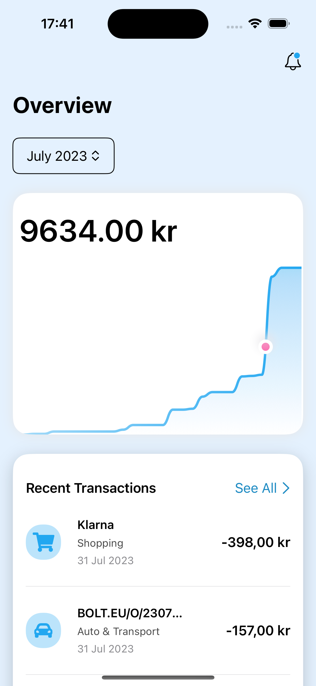
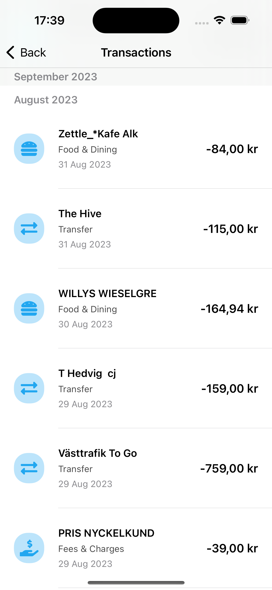

# Expense Tracker
An iOS app made in SwiftUI for tracking expenses

# App Description
This is a project in my ongoing journey of becoming a self-taught iOS app developer. The app is an Expense Tracker, made in SwiftUI. 
This is one of those apps which have a lot more going on behind the scenes than what the user sees in front of them. Here is a run-down of the functionalities in the app:
- Sort expenses by month
- Display a card showing a graph of expenses made in each month 
- Show the top 5 most recent transactions
- Display all transactions categorized by month in a separate view
- Classify transactions into one of nine categories using CoreML
- Classify transactions into one of nine categories using Python model ported to .mlmodel file 
- Implementation of CountVectorizer in Swift
- Display icons for transactions based on categorization
- Dark mode!

# Background
I initially followed the following excellent tutorial provided by DesignCode which can be found [here](https://www.youtube.com/watch?v=Bu6fAlltatA&t=411s). The rest of the app was developed on top of this.

## Initial plans
My original idea was to use this as a base and then, instead of using the hard-coded JSON file containing dummy transactions in the tutorial, load real-time transactions from my own bank account. For this purpose, I was investigating [Plaid API](https://plaid.com/en-eu/). However, I soon found out that Plaid does not support the API to get transactions from the bank that I use.

I investigated a couple of alternatives to Plaid, but I could not find any that had support for my bank. So then I decided to change track, and instead decided to use this app as an excuse to experiment with Swift's Machine Learning capabilities.

## Machine Learning in expense tracking
My first question was: how can I integrate Machine Learning into an expense tracking app? While there are many different ways one can do that, the option that seemed the most straightforward to me was categorizing transactions. This was inspired in part by the fact that the dummy transaction data being used in the tutorial was already categorizing transactions - albeit hard-coding them.

The first step I took was to replace the dummy data with a CSV file of transactions exported from my banking app. Parsing only the transaction names from titles from this CSV, I fed them to ChatGPT and asked it to categorize them into the following nine categories:
- Auto & Transport
- Bills & Utilities
- Entertainment
- Fees & Charges
- Food & Dining
- Home
- Income
- Shopping
- Transfer

ChatGPT did a relatively good job categorizing the 743 transactions I gave it into the above-mentioned nine categories. However, many of the transaction titles were in Swedish, so it didn't have enough context to classify them correctly (for example, it was consistently unable to label transactions under "Västraffik" as "Auto & Transport", even when I told ChatGPT that Västraffik is the public transport agency in Gothenburg and therefore all these transactions should come under "Auto & Transport").

However, this didn't matter to me too much since it was an experiment - highly accurate classification of transactions was never the goal, and would not have been achiveable by data that was both highly skewed (most of the transactions came under "Food & Dining" and "Shopping") and majorly labeled incorrectly.

## Machine Learning in Swift
Having an extensive background in Machine Learning using Python, I was itching to get my hands dirty with CoreML, Swift's Machine Learning framework used across Apple products. I loaded the training data into an MLDataTable, and then performed an 80-20 training and validation data split on it. Finally, I trained an MLTextClassifier on the training data, and tested it on the evaluation data to get an accuracy of around 75 - 80% (over multiple runs).

The code for this can be found in "TransactionCategorization/main.swift" in the "classify_coreml" branch.

## Machine Learning in Python -> Swift
A couple of months ago, I attended a Machine Learning event at a company called Sleep Cycle, where they talked about deploying ML models on iOS. There, they talked about how they have trained a Machine Learning model for classification in Python (using PyTorch), and then converted them to an .mlmodel file for use in Swift.

While they outlined several complications in the conversion process, my experience was relatively straightforward (probably because I used a very simple model). Initially I thought about fine-tuning a BERT model in PyTorch on my transactions data, but thought the resulting model might be too heavy to run efficiently on a phone. Since getting accurate classifications of transactions was not the goal, I then decided to make things simple and went with a relatively simpler RandomForestClassifier in scikit-learn. For feature extraction, I used a CountVectorizer. 

To convert the Python model to a .mlmodel file, I used the [Core ML Tools](https://github.com/apple/coremltools) Python package.

When it came to saving the RandomForestClassifier model to disk and then converting it to a .mlmodel file, I encountered my first complication: the classifier would also need the corresponding vectorizer to be able to extract features from text and classify them. To this end, I tried the following:
1. Create a pipeline in sklearn, containing both a CountVectorizer and a RandomForestClassifier. This worked for training the model, but coremltools does not provide support for sklearn pipelines.
2. Save the CountVectorizer and RandomForestClassifier to disk separately, and convert them both using coremltools. However, I then found out that the only vectorizer coremltools supports is DictVectorizer.
3. This left me the with the third and final option: export only the RandomForestClassifier model to disk and convert it to a .mlmodel file. Then implement a CountVectorizer in Swift to extract features from text, that would extract features from text using the vocabulary exported from the CountVectorizer used in Python.

During this process, I learned something interesting. I used a Python package called "unidecode" to convert the text data to ASCII. Later, when implementing the CountVectorizer in Swift, I found myself needing to use the same module, but this time in Swift. Lucklily, I found a port of this Python library in Swift, called [JMUnidecode](https://github.com/JotaMelo/JMUnidecode-Swift)!

The RandomForestClassifier gave me an F1-score of 85%. However, since the data is so skewed, this did not reflect so well when viewing the classified transactions in the app.

The Python code can be found in the folder "PythonScripts" in the "classify_sklearn_model" branch.

# In action
I consider it best to upload a bunch of screenshots to show the app's layout and working. 
   

<h3 align="center">Main view</h3>

  <kbd>
    
      
    <em>Home view - light</em>
  </kbd>
  
  <kbd>
    
      
    <em>Home view - dark</em>
  </kbd>

  
<h3 align="center">View transactions by months</h3>

  <kbd>
    
      
    <em>Sort by months</em>
  </kbd>
  
  <kbd>
    
      
    <em>Transactions in March 2023</em>
  </kbd>
  
  <kbd>
    
      
    <em>Transactions in July 2023</em>
  </kbd> 

  
<h3 align="center">Most recent transactions</h3>

  <kbd>
    
      
    <em>Recent transactions - light</em>
  </kbd>
  
  <kbd>
    
      
    <em>Recent transactions - dark</em>
  </kbd>

  
<h3 align="center">All transactions</h3>

  <kbd>
    
      
    <em>All transactions</em>
  </kbd>
  
  <kbd>
    
      
    <em>All transactions - August</em>
  </kbd>
  
  <kbd>
    
      
    <em>All transactions - dark</em>
  </kbd> 
  
  <kbd>
    
      
    <em>All transactions - August - dark</em>
  </kbd> 

# Future work
Here are some additional things I would like to try in this project:
- Finetune a BERT model on the transactions in PyTorch, and convert and use that in the app 
- Categorize the transactions farther, into sub-categories
- Set a monthly spending limit, and show how much of that limit has been reached in percentage
- Add support for multiple accounts

However, for now I am happy with the work that I have put into the app, and would like to continue my learning by building other apps. Maybe one day I come back to this!